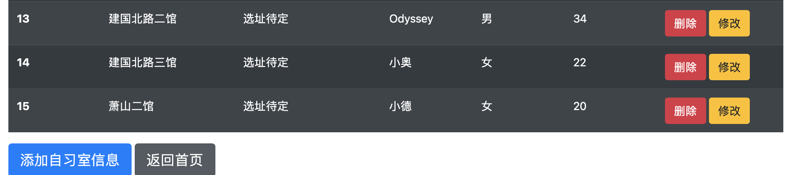

自习室管理系统的设计————Spring Boot的简单实现

一、技术选型：

SpringBoot+MyBatis+Thymeleaf

二、环境搭建：

1、创建springboot项目
2、导入Maven依赖
3、创建数据库，建表，插入相关数据

三、代码编写

1、管理员登陆

2、首页

3、自习室信息页

4、公告页以及详情

5、学员信息管理以及黑名单管理

四、结语：

这是我的第一个项目。实际的学习和开发时间大约为十五天。每天花在方案上的时间少则3、4个小时，多则一天。这中间的困难包括概念的理解（依赖、接口、映射，等等），以及实际写代码的过程中报错的解决，还有前端页面的编写。方案的实现有些仓促，这跟前期构思不够完善也有关系。总体上，这段时间让我从原理以及代码层面认识到了开发一个项目的基本框架以及实施的细节，也让我感受到了从无到有，去搭建一个方案的乐趣。最大的感想就是学得越多，就能应用得越多，保持学习的态度和一颗时时鼓励自己的心，总是可以慢慢地成长的。

